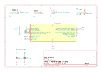

# AT (PS/2) keyboard to USB converter

PIC16F1459 solution for converting old AT (PS/2) keyboard to USB.

## Hardware

Schematic and one layer PCB can be found under `hardware` directory.
The hardware design is created using KiCad 7.0.
The circuit is very simple and it can be created easily on prototyping board.

## Firmware

The firmware is developed with MPLAB X IDE, found under `at2usbClassic.X` directory.
USB stack implementation and main HID app code is based on USB HID keyboard project from [Microchip Libraries for Applications (MLA)](https://www.microchip.com/en-us/tools-resources/develop/libraries/microchip-libraries-for-applications).